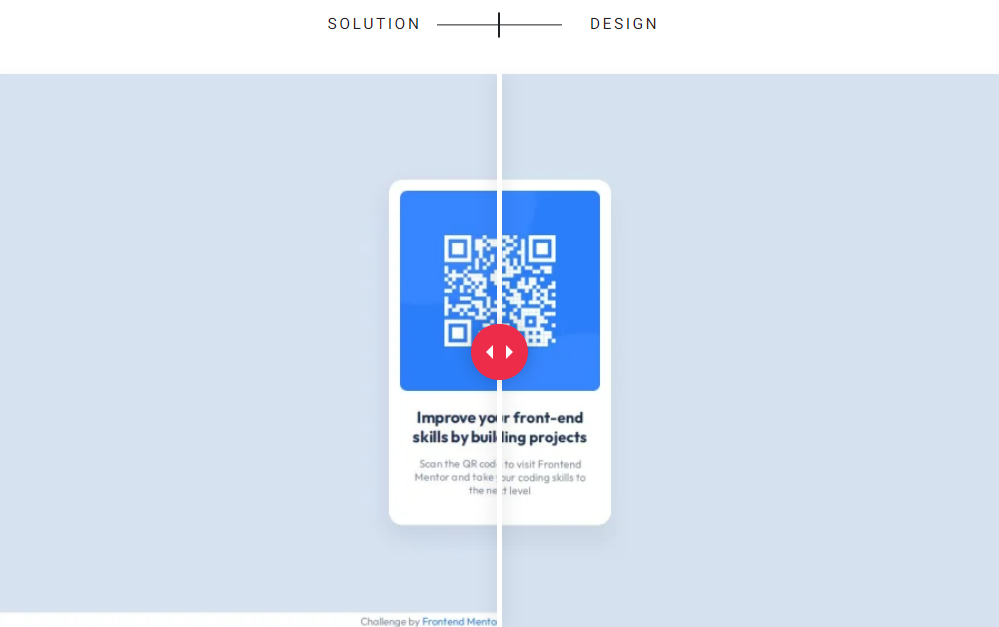

# Frontend Mentor Challenge - QR code component solution

This is a solution to the [QR code component challenge on Frontend Mentor](https://www.frontendmentor.io/challenges/qr-code-component-iux_sIO_H). Frontend Mentor challenges help you improve your coding skills by building realistic projects.

## Table of contents

- [Overview](#overview)
  - [Screenshot](#screenshot)
  - [Links](#links)
- [My process](#my-process)
  - [Built with](#built-with)
  - [Useful resources](#useful-resources)
- [Author](#author)

## Overview

### Screenshot

### Links

- Live Demo: [QR Code Component](https://margauxarmanet.github.io/Frontend-Mentor-Challenge-QR-Code-Component/)

## My process

### Built with

- Semantic HTML5 markup
- CSS custom properties
- Mobile-first workflow
- Media queries
- Google Fonts

### Useful resources

- [MDN Web Docs](https://developer.mozilla.org/en-US/docs/Web) - Comprehensive documentation on HTML, CSS, and JavaScript.
- [HTML course by Dave Gray](https://youtu.be/mJgBOIoGihA?si=bGPk9p8BWIlWFTZZ) - For learning HTML basics and advanced concepts.
- [CSS course by Dave Gray](https://youtu.be/n4R2E7O-Ngo?si=0kVqYd5vWbO9zCEj) - For learning CSS basics and advanced concepts.

## Author

- [Margaux Armanet](https://github.com/MargauxArmanet) - Connect with me on [LinkedIn](https://www.linkedin.com/in/margaux-armanet/)
